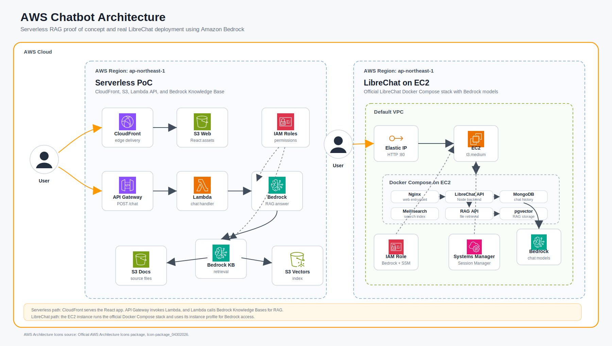

# AWS Serverless Chatbot PoC

AWS上で動く社内Q&A向けチャットボットPoCです。このリポジトリには、軽量なサーバーレスPoCと、本物のLibreChatをAWS上で動かすEC2構成を含めています。

- Serverless PoC: React + Vite, CloudFront, S3, API Gateway, Lambda, Amazon Bedrock Knowledge Bases
- LibreChat: EC2, Docker Compose, LibreChat, MongoDB, Meilisearch, RAG API, Amazon Bedrock
- IaC: Terraform

## AWS Architecture



The diagram uses the official [AWS Architecture Icons](https://aws.amazon.com/architecture/icons/) package.

The serverless PoC serves the React app from S3 through CloudFront. Chat requests go to API Gateway, which invokes the Lambda handler. The handler calls Bedrock Knowledge Bases to retrieve relevant document chunks and generate an answer.

LibreChat runs as the official Docker Compose deployment on a single EC2 instance. AWS credentials are not stored in the app; Bedrock access uses the EC2 instance profile and the AWS SDK default credential chain.

## Directory Layout

```text
api/              Lambda handler
docs/             Setup and operation notes
infra/            Terraform configuration for the serverless PoC
infra-librechat/  Terraform configuration for LibreChat on EC2
web/              React + Vite frontend
```

## Quick Start: Serverless PoC

1. AWS CLIで対象アカウントにログインします。
2. Bedrockのモデルアクセスを有効化します。
3. Terraform変数を設定します。

```bash
cd infra
cp terraform.tfvars.example terraform.tfvars
terraform init
terraform apply
```

4. `documents_bucket_name` に文書をアップロードします。
5. Bedrock data sourceの同期を実行します。
6. `web` をビルドし、`web_bucket_name` に配置します。

詳細は [docs/setup.md](docs/setup.md) を参照してください。

## Quick Start: LibreChat

LibreChat構成は [infra-librechat/README.md](infra-librechat/README.md) を参照してください。初回起動ではEC2上でDockerをセットアップし、公式LibreChatイメージをpullするため数分かかります。
